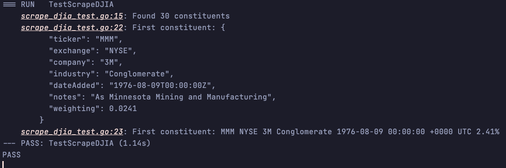

# Dow Jones Industrial Average Constituent Scraper

Scrapes DJIA companies from [Wikipedia - Dow Jones Industrial Average](https://en.wikipedia.org/wiki/Dow_Jones_Industrial_Average).

**Please be considerate when scraping (cache if possible).**  

## Installation
```bash
go get github.com/phoobynet/djia-constituent-scraper
```

## Usage

```go
package main

import (
    "fmt"
    djia "github.com/phoobynet/djia-constituent-scraper"
)

func main() {
    constituents, err := djia.ScrapeDJIA()

    if err != nil {
        panic(err)
    }

    if len(constituents) > 0 {
        fmt.Printf("Found %d constituents", len(constituents))

        asJSON, err := constituents[0].JSON()

        if err != nil {
            panic(err)
        }
		
		// pretty print as JSON
        fmt.Printf("First constituent: %s", asJSON)
		
		// print as string
        fmt.Printf("First constituent: %s", constituents[0])
    } else {
        panic("No constituents found")
    }
}
```

## Result




